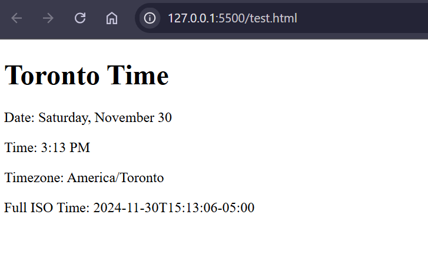

# goTimezoneApi

This implementation:
Creates an HTTP endpoint at /time
Returns the current Toronto time in JSON in both ISO and user-friendly human readable formats.
Stores each request time in a MySQL database
Properly handles the Toronto timezone
Returns both the current time and timezone information

Then we can test it by making a GET request to `http://localhost:8080/time`

Some additional considerations:
Error handling is implemented.
We might want to add environment variables for database credentials
The database connection could be moved to a separate package for better organization
We might want to add request logging middleware

For production, we have also implemented CORS handling

Explanation:
CORS Middleware: The corsMiddleware function sets the necessary CORS headers. It allows all origins (*), but you can specify a particular domain if needed for security reasons.

Preflight Requests: The middleware checks if the request method is OPTIONS, which is used for preflight requests in CORS. If so, it returns immediately after setting the headers.

Integration: The middleware is applied to the /time endpoint by wrapping the getTorontoTime handler.

This setup will allow your API to handle CORS requests properly. Adjust the Access-Control-Allow-Origin header to restrict access to specific domains if needed for your production environment.

Multiple methods to test the API:

To run the go app, ensure `docker` is `up and running` and you've `docker-compose` installed on your system.

by `go run main.go` and ensure that your mysql instance is up and running and connected.

1. Use cURL in the terminal

`curl http://localhost:8080/time`

2. Use a Web browser: Simply open your browser and navigate to: [[text](http://localhost:8080/time)](http://localhost:8080/time) 
   
   
3. Use Postman
   Create a new GET request to `http://localhost:8080/time`
   

4. Use JavaScript in the browser console:

    `fetch('http://localhost:8080/time')
    .then(response => response.json())
    .then(data => console.log(data))
    .catch(error => console.error('Error:', error));`

5. Double-click `test.html` or serve the `test.html` page using a `live-server` using vscode `live-server plugin` and you'll see the output:
    
    

To verify everything is working correctly:

1. Check API Response:

The API will return `JSON` in this format:
`{
    "current_time": "2024-11-30T14:51:26-05:00",
    "readable_time": "2:51 PM",
    "readable_date": "Saturday, November 30",
    "timezone": "America/Toronto"
}`

2. Verify Database Logging:
   Check if entries are being logged in MySQL:

   `USE timedb;
    SELECT * FROM time_logs;`